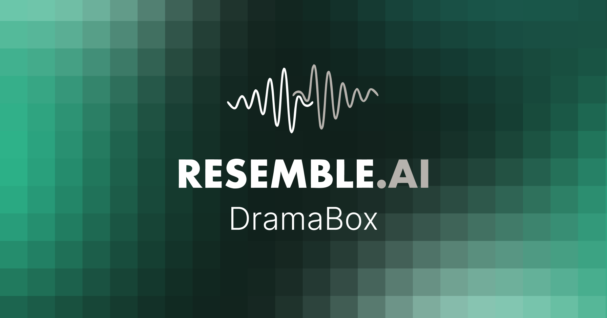

<p align="center">
  <a href="https://www.resemble.ai/learn/models/dramabox">
    
  </a>
</p>

# DramaBox — Expressive TTS with Voice Cloning

[](https://huggingface.co/spaces/ResembleAI/Dramabox)
[](https://discord.gg/rJq9cRJBJ6)

> **Built on [LTX-2](https://github.com/Lightricks/LTX-2) by Lightricks.**
> DramaBox is **Resemble AI's** expressive TTS, trained on top of the LTX-2.3 audio branch under the LTX-2 Community License. Huge thanks to the Lightricks team for open-sourcing the base.

*Made with ♥️ by* <a href="https://www.resemble.ai/learn/models/dramabox" target="_blank"></a>

Prompt-driven TTS with voice cloning. The prompt itself controls speaker identity, emotion, delivery style, laughs, sighs, pauses and transitions; an optional 10-second voice reference clones the target timbre. DramaBox is an IC-LoRA fine-tune of the **LTX-2.3 3.3B audio-only** model.

| | |
|---|---|
| 🤗 **Model** | [`ResembleAI/Dramabox`](https://huggingface.co/ResembleAI/Dramabox) |
| 🎭 **Demo Space** | [`ResembleAI/Dramabox`](https://huggingface.co/spaces/ResembleAI/Dramabox) (ZeroGPU) |
| 🏗️ **Base model** | [`Lightricks/LTX-2.3`](https://huggingface.co/Lightricks/LTX-2.3) |
| 📜 **License** | LTX-2 Community License — see [`LICENSE`](LICENSE) |

## Models

Auto-downloaded from the HF model repo on first run.

| File | Size | Description |
|---|---|---|
| `dramabox-dit-v1.safetensors` | 6.6 GB | DiT transformer (LoRA already merged into base) |
| `dramabox-audio-components.safetensors` | 1.9 GB | Audio embeddings connector + audio text projection + audio VAE + vocoder |
| [`unsloth/gemma-3-12b-it-bnb-4bit`](https://huggingface.co/unsloth/gemma-3-12b-it-bnb-4bit) | ~8 GB | Text encoder |

**VRAM**: ~24 GB peak · **Speed**: ~2.5 s / generation (warm server, H100)

## Quick Install (Windows)

The fastest way to get DramaBox running on a fresh machine:

1. Download or clone this repository.
2. Double-click **`Install.bat`**.
   - Installs Python 3.11, Git, and FFmpeg if missing (via `winget`), creates a
     `venv\`, and installs all dependencies (PyTorch with CUDA 12.8 support,
     then the rest of `requirements.txt`).
   - Takes 5-15 minutes depending on your internet connection (~3-4 GB
     download for PyTorch + dependencies).
   - Creates a **DramaBox** shortcut on your Desktop.
3. Double-click **`Launch.bat`** (or the new Desktop shortcut).
   - First launch downloads ~17 GB of model weights (one-time, cached under
     `%USERPROFILE%\.cache\dramabox\`).
   - Once ready, open **http://127.0.0.1:7860** in your browser.

**Requirements:** Windows 10/11, NVIDIA GPU with 24 GB VRAM (RTX 4090 or
similar), ~40 GB free disk space.

If `Install.bat` reports that `winget` is unavailable or a prerequisite
failed to install (common on locked-down corporate machines), install it
manually using the links the script prints, then re-run `Install.bat`:

- Python 3.11: https://www.python.org/downloads/release/python-3119/ (check **"Add python.exe to PATH"**)
- Git: https://git-scm.com/download/win
- FFmpeg: https://www.gyan.dev/ffmpeg/builds/ (download "release full", extract, add the `bin\` folder to your PATH)

To produce a shareable copy of the project (excluding `venv\` and generated
audio), run `.\make_release.ps1` — it creates `dist\DramaBox-release.zip`.

For full manual setup details, or if you'd rather install everything by hand,
see the section below.

## Windows install (NVIDIA GPU, 24 GB VRAM)

> This section documents the manual steps that `Install.bat` automates above —
> useful for troubleshooting or non-standard setups.

Tested on **Windows 10/11** with an **RTX 4090 (24 GB)**. An RTX 4090 at 24 GB is at the documented peak VRAM — it works, but use the settings below.

### Prerequisites

| Requirement | Notes |
|---|---|
| Python **3.11** | Avoid 3.13 — deps are tested on 3.11 |
| Git | Required for `resemble-perth` |
| FFmpeg on `PATH` | [gyan.dev](https://www.gyan.dev/ffmpeg/builds/) full build recommended |
| ~35 GB free disk | ~17 GB model weights + ~8 GB Gemma + venv |
| NVIDIA driver + CUDA | PyTorch 2.8 cu128 wheels bundle CUDA libs |

### 1. Clone and create venv

```powershell
git clone https://github.com/resemble-ai/DramaBox.git
cd DramaBox
py -3.11 -m venv venv
.\venv\Scripts\Activate.ps1
python -m pip install --upgrade pip
```

### 2. Install CUDA PyTorch **before** other deps

Plain `pip install -r requirements.txt` can pull a **CPU-only** torch from PyPI on Windows. Install GPU wheels first:

```powershell
pip install torch==2.8.0 torchaudio==2.8.0 --index-url https://download.pytorch.org/whl/cu128
python -c "import torch; print(torch.__version__, torch.cuda.is_available(), torch.cuda.get_device_name(0))"
```

Expected: `True` and your GPU name (e.g. `NVIDIA GeForce RTX 4090`).

**Pin `torchaudio==2.8.0`** — newer torchaudio (2.11+) pulls in `torchcodec`, which is painful on Windows.

### 3. Install remaining dependencies

Comment out the first two lines of `requirements.txt` (`torch` / `torchaudio`), then:

```powershell
pip install -r requirements.txt
```

Or install manually (skip torch lines):

```powershell
pip install safetensors accelerate peft av einops PyYAML sentencepiece "transformers>=4.45.0" "huggingface_hub>=0.20.0,<1.0" bitsandbytes gradio==5.7.1 spaces soundfile pydantic==2.10.6
pip install "resemble-perth @ git+https://github.com/resemble-ai/Perth.git@master"
```

**Do not install** `requirements-reuse.txt` on Windows (see [RE-USE](#voice-reference-denoising-re-use) below).

### 4. Launch Gradio (recommended)

Use the included launcher — it sets the correct dtype and env vars:

```powershell
.\launch.ps1
```

Open **`http://127.0.0.1:7860`** in your browser (not `0.0.0.0:7860`).

First launch downloads ~16 GB of weights into `%USERPROFILE%\.cache\dramabox\` and loads Gemma + DiT (~3–5 minutes). Subsequent starts are much faster.

**Environment variables** (set automatically by `launch.ps1`):

| Variable | Value | Why |
|---|---|---|
| `LTX_DTYPE` | `bf16` | **Required** — see [Troubleshooting](#troubleshooting-windows) |
| `PYTORCH_CUDA_ALLOC_CONF` | `expandable_segments:True` | Reduces VRAM fragmentation on 24 GB |
| `GRADIO_SHARE` | `0` | Local-only UI (no public gradio.live link) |
| `PYTHONIOENCODING` | `utf-8` | Avoids Gradio client encoding errors |

Verify CUDA anytime:

```powershell
.\test_cuda.ps1
```

### 5. Example prompt

```
A radio host clears his throat, "This is bindu from flat 340 " He settles into a warm, professional tone, "Good evening everyone, and welcome back to the show. We have got a wonderful lineup tonight."
```

Generated WAV files are saved under [`output/`](output/).

### Windows limitations

- **RE-USE voice-reference denoising** (`mamba-ssm` / `causal-conv1d`) has no Windows wheels. Leave **Denoise voice reference** unchecked in the Gradio UI — voice cloning still works without it.
- **Symlink warning** from Hugging Face cache on Windows is harmless; enable Developer Mode or run as admin to silence it.

## Quick Start

### Warm server (recommended)

```python
from src.inference_server import TTSServer

server = TTSServer(device="cuda")

server.generate_to_file(
    prompt='A woman speaks warmly, "Hello, how are you today?" She laughs, "Hahaha, it is so good to see you!"',
    output="output.wav",
    voice_ref="reference.wav",   # optional, 10+ seconds
)
```

### CLI

```bash
python src/inference.py \
  --voice-sample reference.wav \
  --prompt 'A woman speaks warmly, "Hello, how are you today?"' \
  --output output.wav \
  --cfg-scale 2.5 --stg-scale 1.5
```

### Gradio app

**Windows** (recommended):

```powershell
.\launch.ps1
# → http://127.0.0.1:7860
```

**Linux / manual:**

```bash
export LTX_DTYPE=bf16
export PYTORCH_CUDA_ALLOC_CONF=expandable_segments:True
CUDA_VISIBLE_DEVICES=0 python app.py
```

## Inference Settings

| Parameter | Default | Notes |
|---|---|---|
| `cfg-scale` | 2.5 | Lower = more natural, higher = more text-faithful |
| `stg-scale` | 1.5 | Skip-token guidance |
| `rescale` | 0 | No rescaling |
| `modality` | 1 | No modality guidance |
| `duration-multiplier` | 1.1 | 10% breathing room on auto-estimated length |
| `steps` | 30 | Euler flow matching |

## Prompt Writing Guide

**Structure:** `<speaker description>, "<dialogue>" <action direction> "<more dialogue>"`

**Inside quotes** (model produces actual sounds):
- Laughs: `"Hahaha"` `"Hehehe"` (always one word, never separated)
- Sounds: `"Mmmmm"` `"Ugh"` `"Argh"` `"Ahhh"` `"Hmm"`

**Outside quotes** (stage directions):
- `She sighs deeply.` · `He gulps nervously.` · `A long pause.`
- `Her voice cracks.` · `He clears his throat.` · `She scoffs.`

**Avoid inside quotes** (model speaks them literally): `Ahem`, `Pfft`, `Sigh`, `Gasp`, `Cough`.

**Tips**
- Match gender/age in the speaker description to the voice reference
- Break long dialogue into segments with action directions in between
- End the prompt at the last closing quote mark (no trailing description)

## Watermarking

Every audio output from `inference.py` and `inference_server.TTSServer.generate_to_file` is automatically watermarked with [Resemble Perth](https://github.com/resemble-ai/Perth) — an imperceptible neural watermark that survives MP3 compression, audio editing, and common manipulations while maintaining nearly 100% detection accuracy.

```python
import perth, librosa
wav, sr = librosa.load("output.wav", sr=None, mono=True)
detector = perth.PerthImplicitWatermarker()
print(detector.get_watermark(wav, sample_rate=sr))   # confidence ≈ 1.0
```

Pass `--no-watermark` to `inference.py` (or `watermark=False` to `generate_to_file`) to disable for debugging.

## Voice reference denoising (RE-USE)

> **Opt-in.** RE-USE deps (`mamba-ssm`, `causal-conv1d`, `librosa`, `resampy`)
> are **not** installed by default — `mamba-ssm` / `causal-conv1d` have no
> pre-built wheels on macOS / Windows and require matching CUDA + nvcc on
> Linux, which breaks many fresh installs. The base `requirements.txt` skips
> them; install only when you want voice-reference denoising:
>
> ```bash
> pip install -r requirements-reuse.txt
> ```
>
> If the deps are missing at runtime, the server logs a one-line "denoise
> disabled — pip install -r requirements-reuse.txt to enable" warning and
> continues generation without denoising the reference.

When installed, the voice reference is denoised with [`nvidia/RE-USE`](https://huggingface.co/nvidia/RE-USE) before VAE conditioning. On (defaults to `True`):

```python
server.generate_to_file(
    prompt='A woman speaks warmly, "Hello."',
    output="out.wav",
    voice_ref="ref.wav",
    denoise_ref=True,
)
```

Setup is automatic — code (`.py` / `.yaml`, ~150 KB) is snapshot-downloaded into `~/.cache/dramabox/` on first call; weights (`~38 MB`) come from `SEMamba.from_pretrained` through the standard HF cache. Pass `$REUSE_DIR` or vendor at `third_party/RE-USE/` to skip the download.

If the `mamba-ssm` / `causal-conv1d` wheels fail to build on a supported Linux box, the wrapper falls back to a pure-PyTorch path (5-10× slower, same output). RE-USE is [NSCLv1](https://github.com/NVlabs/HMAR/blob/main/LICENSE) (non-commercial) — set `denoise_ref=False` to skip.

## Long-form generation (text chunking)

The base LTX-2.3 audio DiT was trained on clips ≤ ~20 s. Generations up to ~45 s remain usable thanks to the silence-prior patch in `inference_server.py`, but quality drifts past that. For arbitrarily long prompts, `TTSServer` now chunks automatically:

```python
server.generate_to_file(
    prompt=very_long_scene,        # 2 minutes worth of dialogue is fine
    output="long.wav",
    voice_ref="ref.wav",           # reused across every chunk → speaker stays coherent
)
```

The chunker (`src/text_chunker.py:chunk_prompt_for_duration`) splits at sentence / quote-group boundaries, preserves the speaker-description prefix on every chunk, and targets ~37 s per chunk (≤45 s hard cap). `TTSServer.generate_long` then concatenates the per-chunk waveforms with a 50 ms equal-power crossfade so joins are inaudible. Set `max_chunk_duration=` / `target_chunk_duration=` on `generate_to_file` to tune.

## Training a LoRA on top of DramaBox

You can fine-tune your own LoRA using DramaBox itself as the base — no need to start from raw LTX-2.3. Useful for adding a specific speaker, language flavour, or style on top of the existing expressive prior.

### 1. Prepare your index file

The preprocessor accepts four formats. The `text` field is the **target transcript**; if you want to attach a scene-style prompt (the part the model conditions on at inference time), prepend it to the transcript in the same format the model was trained on:

> `A woman speaks warmly, "<your transcript here>"`

Both forms are supported — with or without the prompt wrapper. Without the wrapper the model treats the entry as plain text-to-speech.

**Format A — `manifest` (JSONL)** — recommended for new datasets:

```jsonl
{"audio_filepath": "wavs/spk01_001.wav", "text": "A woman speaks warmly, \"Hello, how are you today?\""}
{"audio_filepath": "wavs/spk01_002.wav", "text": "Hello, how are you today?"}
{"audio_filepath": "wavs/spk02_001.flac", "text": "An exhausted father sighs, \"Sweetie, daddy is asking very nicely.\"", "duration": 4.7}
```

Fields: `audio_filepath` (or `audio_path`) is required, `text` (or `transcript`) is required, `duration` is optional.

**Format B — `tsv`** — simplest, one line per sample:

```
wavs/spk01_001.wav	A woman speaks warmly, "Hello, how are you today?"
wavs/spk01_002.wav	Hello, how are you today?
```

**Format C — `gemini_synthetic`** — `~`-separated, used for prompted synthetic data:

```
id~speaker~lang~sr~samples~dur~phonemes~text
spk01_001~spk01~en~24000~93000~3.875~_~A woman speaks warmly, "Hello, how are you today?"
```

**Format D — `libriheavy`** — `~`-separated, for unprompted text-only data:

```
id~speaker~lang~samples~dur_ms~phonemes~text
spk01_001~spk01~en~93000~3875~_~Hello, how are you today?
```

### 2. Preprocess

```bash
python src/preprocess.py \
  --dataset-type manifest \
  --index your_data.jsonl \
  --audio-dir /path/to/wavs \
  --output-dir /path/to/preprocessed/ \
  --checkpoint /path/to/dramabox-audio-components.safetensors \
  --gemma-root /path/to/gemma-3-12b-it-bnb-4bit/ \
  --max-duration 20.0 --min-duration 2.0
```

Output layout (training-ready `.pt` files):

```
preprocessed/
├── audio_latents/sample_*.pt     # Audio VAE-encoded latents
├── conditions/sample_*.pt        # Gemma text embeddings
└── latents/sample_*.pt           # Dummy video latents (placeholder)
```

### 3. Train

Copy `configs/training_args.example.yaml`, point `data_dir` / `speaker_index` at your preprocessed output, set `checkpoint` + `full_checkpoint` to the DramaBox files, then launch with HuggingFace `accelerate`. Any flag passed on the CLI overrides the YAML.

```bash
accelerate launch src/train.py \
  --config configs/training_args.example.yaml
```

The trainer attaches a fresh LoRA to the audio branch on top of the DramaBox checkpoint. LoRA targets: `audio_attn1.{to_q,to_k,to_v,to_out.0}` + `audio_ff.{net.0.proj,net.2}` × 48 transformer blocks (288 LoRA pairs total). Default rank 128 / alpha 128 / dropout 0.1, cosine LR schedule from 1e-4 with 500-step warmup over 10k steps.

To monitor training, set `val_config: configs/val_config.example.yaml` in your training YAML — `src/validate.py` is then spawned at every save step to generate one wav per speaker entry, so you can A/B listen during the run.

### Inference with your trained LoRA

```bash
python src/inference.py \
  --lora /path/to/your/lora_step_5000.safetensors \
  --voice-sample reference.wav \
  --prompt 'A woman speaks warmly, "..."' \
  --output output.wav
```

Always load the LoRA at inference rather than pre-merging it — pre-merged checkpoints have produced degraded output in our runs.

## Troubleshooting (Windows)

### No audio / silent WAV files

**Symptom:** Generation completes, but the player is silent. Logs may show:

```
Perth watermark skipped (Audio buffer is not finite everywhere)
```

**Cause:** `LTX_DTYPE=fp16`. DramaBox / LTX-2.3 is trained in **bfloat16**; fp16 causes the vocoder to output all-NaN waveforms.

**Fix:** Use **`bf16`** (default in `launch.ps1`):

```powershell
$env:LTX_DTYPE = "bf16"
.\launch.ps1
```

Never set `LTX_DTYPE=fp16` on this setup.

### Generation very slow or UI appears frozen

**Symptom:** A short prompt takes minutes instead of ~10–20 s.

**Cause:** VRAM maxed out (~24 / 24 GB) after multiple runs or overlapping Generate clicks.

**Fix:**

1. Close other GPU apps (games, ComfyUI, etc.).
2. Restart the server: stop `python app.py`, then `.\launch.ps1`.
3. Wait for one job to finish before clicking Generate again.

### `mat1 and mat2 shapes cannot be multiplied` (188160×…)

**Cause:** Gemma hidden-state layer count mismatch with the embeddings processor (transformers version drift).

**Fix:** The repo includes a patch in `ltx2/ltx_core/text_encoders/gemma/feature_extractor.py` that trims extra layers. Pull latest or ensure that file is present, then restart.

### CUDA not detected

```powershell
.\test_cuda.ps1
```

If `cuda_available False`, reinstall GPU PyTorch (step 2 above) **before** other packages. Uninstall CPU torch first if needed:

```powershell
pip uninstall torch torchaudio -y
pip install torch==2.8.0 torchaudio==2.8.0 --index-url https://download.pytorch.org/whl/cu128
```

### Voice cloning tips

- Upload a clean **10+ second WAV** as voice reference.
- Leave **Denoise voice reference** unchecked on Windows.
- Match gender/age in the prompt to the reference voice.
- Put spoken lines **inside double quotes**; stage directions go outside (see [Prompt Writing Guide](#prompt-writing-guide)).

## Language

English.

## License & acknowledgement

DramaBox is a Resemble AI fine-tune of [LTX-2](https://github.com/Lightricks/LTX-2). Distributed under the LTX-2 Community License Agreement — see [`LICENSE`](LICENSE). Thanks again to Lightricks for releasing the base model.
